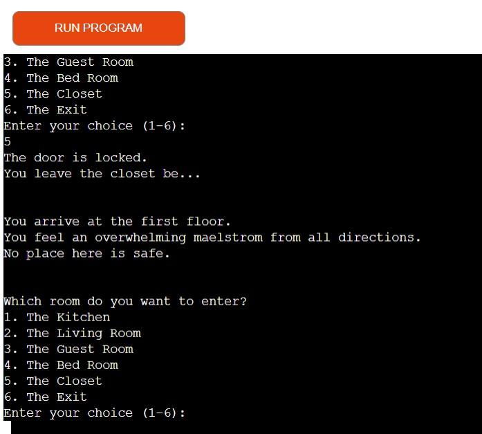
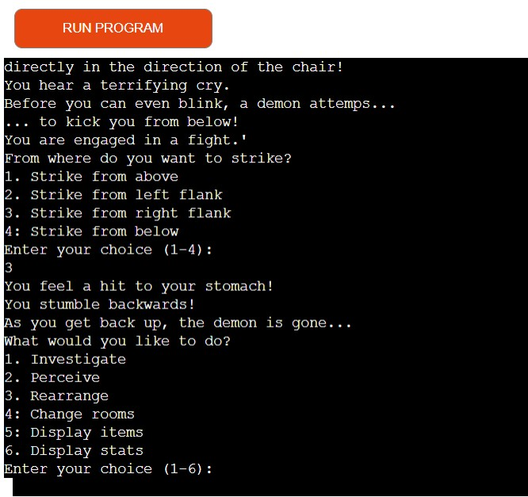
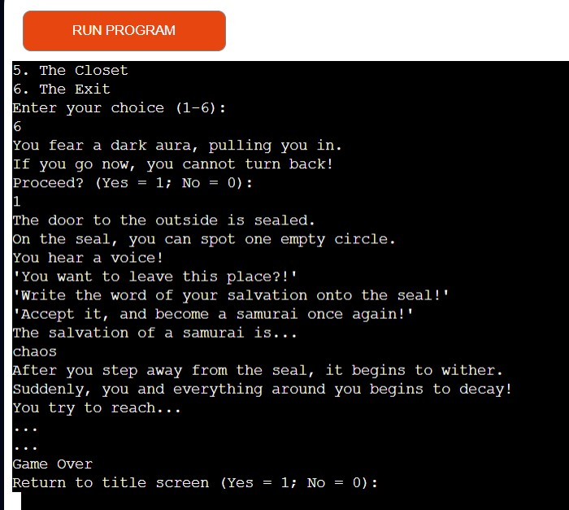
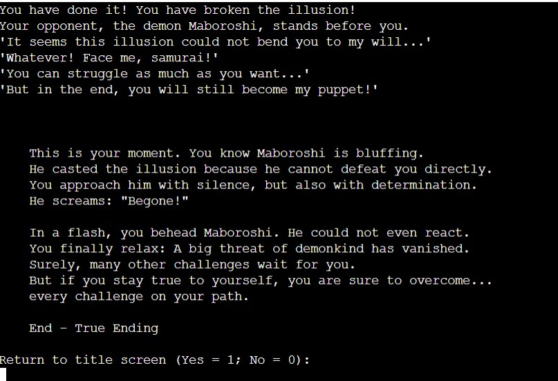
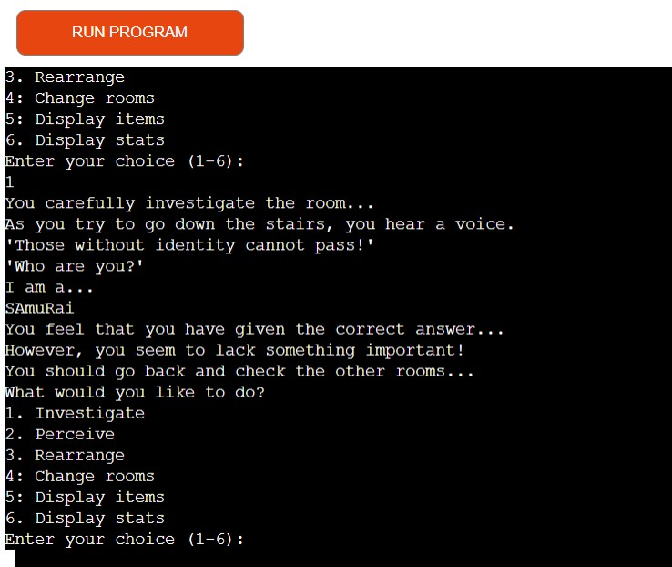
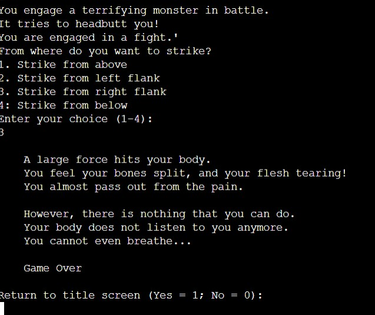
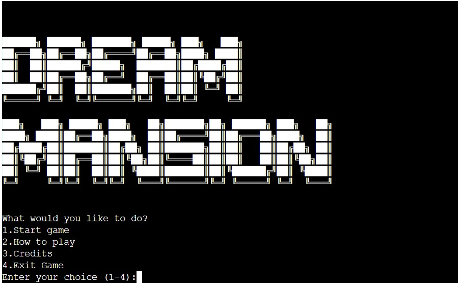
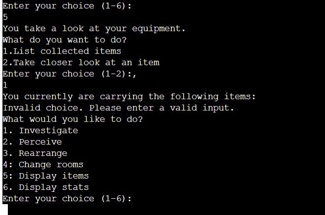
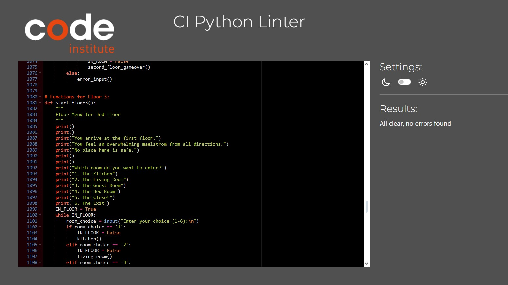

# Dream Mansion

Dream Mansion is a text-based game. It is inspired by the Animation Series "Kimetsu no Yaiba".
Similar to the Episodes 10-14, the player is trapped in a mansion.

The player's goal is to escape the mansion and find out who they really are.

## Index

1. [How to play](#How-to-play)
2. [Planning Stages](#planning-stages)
3. [Structure](#structure)
4. [Testing](#testing)
5. [Deployment](#deployment)
6. [Credits](#credits)

## **How to play**

As a player, your main choice of interacting with the game is structured in two ways.

### Number Input

In most cases, after displaying a story text, the game will display a menu.
Each item in that menu is listed with a number.
The player puts that number into that console.
If the string match, the chosen action will be executed.
Any other inputs will result in an error message and replay the last menu.

#### Floor Menus

The game consists of three floors. Each floor has its own floor menu.
In that menu, the player can choose which room to enter.
The number is at least three, at most 6 options.
In most cases, the player can return to the floor menu.
However, there are rooms which behave differently for the players.

#### Fight Menus

After the first floor, the player can engage in combat scenarios against demon illusions.
These are triggered when choosing certain options in new rooms.
In that case, the player is redirected to the fight menu.

The player can choose to attack the demons from above, the left, the right or below.
In each scenario, the idea is to mirror the attack of the demon illusion.
Each attack direction is linked with a certain button.

If the player is successful, the focus of the player will rise by 1.
If the player is unsuccessful, the constitution of the player will decrease by 2.
Each battle can only be triggered once.

#### Room Menu

In each room, the player has access to the Room Menu. This menu offers six options.
The first three - Investigate, Perceive and Rearrange - trigger interactions and progress the story.
The fourth option allows players to switch room. They will be redirected to the floor menu.
The fifth option enables the player to see all items and use them to gain further information.
Finally, option number 6 displays the stats to the character.

### Text Input

Naturally, a text-based game revolves around player output.
However, this game makes mostly use of singular numerical input.
Thus the aspect of typing is reserved for a few interactions.

#### Item Menu

In order to access their collected items, the player has to type in their name.
In this case, the console will check whether an entry in the inventory matches the player input.
They then can decide whether to get a general description of it or interact with it.
Some items describe a general use of the weapon and have no further usage.
Other items contain text which reveal vital hints on clues or advice for combat situations.

If the player does not know which items he has, they can display them by choosing the first option in the items menu.

#### Riddles

After picking certain options in the room menu, the player is asked to input certain words.
These generally check if the player has understood the general motive of the samurai.
The first solution is 'samurai' and the second is 'death'.

The player is given hints in form of the items and also the message hidden in the closet.
The first riddle can be redone infinitely, while failing the second riddle results in a game over.

### Player Goals

#### Stats

When entering the mansion, the code contains a player instance.
The instance has three stats: Constitution, Focus and Luck. Their starting value is 5 for each of them.
Depending on the actions the player takes, these will either rise or decrease.
The stats determine what ending the player will experience.

#### Stat Game Over

If any stat should fall below 1, the player is shown a short statement in which they perish.
The game then starts anew.
The player is thus incentivised to keep up any stat below one and avoid scenarios that will lower these stats.

#### Endings

The ending of the game is also inspired by "Kimetsu no Yaiba".
If the player manages to get to the end, they find out the truth.
The mansion was a dream, an illusion cast by a demon they were fighting, Maboroshi.
The program will determine which ending the player gets based on the final stats.

1. Bad Ending (5 or below): The player is taken over by Maboroshi and helps their new master conquer Kyoto.
2. Neutral Ending (6 to 10): The player takes down Maboroshi, but dies in the process.
3. Good Ending(11+): The player defeats Maboroshi and lives on to fight other demons.

## **Planning Stages**

### General Idea:

One goal of entering the Code Institute program was for me to program a video game.
A recommended idea I found while researching for possible projects was to create a text-based game.
While not my favourite genre of games, I have played many different visual novels.
As such, I had experience of how to envision the progression of such a game.

The only step from there was to envision a setting.
To keep the story concise, I stuck with a more functional setting. The player should feel like they are in an escape room spanning multiple floors. 
While connceptualizing this idea, I remembered a story line from the famous animation series "Demon Slayer" or "Kimetsu no Yaiba".
It took place in a mansion where the trapped party had to best multiple demons.
I then added a final scenario based off the movie from the same franchise.

### Target Audience(s):

The player:

- enjoys visual novels or text-based games.
- is interested in historical or modern Japan.
- enjoys solving puzzles.
- likes dark stories.
- is ideally above 16 years.

### Site Aims

Dream Mansion:

- tells a concise, but captivating story.
- tasks the player with solving riddles around the samurai.
- provides insight into samurai mentality.
- presents simple fighting scenarios.
- tasks the player with a simple, yet all-present stat management challenge.

### User Expericence:

As a user:

- I want to get a short overview about the game.
- I want to know which action I can take at any point.
- I want to know what items I have collected along the way.
- I want to be given clues with which to solve the game.
- I want to know how I am doing.
- I want to experience a tension-filled story.
- I want to know what happens to my character in the end.

## **Structure**

### General Structure

In essence, Dream Mansion consists of four bigger parts. 
The first three parts are the three floors of the mansion.
The last part, while non-interactive, is the narrative highlight, as it reveals the truth to the players and shows them their overall performance via different endings.

### First Floor

The first floor is an introductory stage of the game. 
The player obtains important items and gets a feeling for the mechanics. 
At this stage, there is no combination of events that could lead to a game over.

The floor consists of three rooms:

- In the lounge, the player can find two items: the Katana and Musashi's Diary. This room mainly serves to illustrate two things: 

1. Knowledge is important for figuring out the game, and this knowledge will be essential for mastering the game. 
2. If the player does not thread carefully, they can loose their stats.

- The storage room simulates a battle scenario, whereby having the katana alone turns one negative event into a positive event for the player.

- The first puzzle shows its head right before the next floor. The riddle checks whether you have understood the theme of the game and also checks whether the player has a katana in their inventory
- Without it, the class does not let the player progress any further.

### Second Floor

The second floor has the most fights in the game. 
The player experiences and learns to master the fights with demon illusions.
From this stage on, the player's action can result in a game over.

The floor consists of four rooms:

- The gym has a good chance of positively influencing the player's stats if they pick the right solution. At the same time, this room contains the first battle with the fight menu. Thus, they are likely to gamble 2 Constitution due to not having found the item in the bathroom.
- The office has a very similar design. It is a fight room, which could cost the player dearly if they have no other idea how the fight system operates.
- The bathroom is the most important room on this floor. It contains a guide for battles in Demons 101 and can noticebly increase Constitution as well as luck. However, triggering the power_out will keep players out from gaining both boosts if they cause a power_out.
- The end of the corridor contains a monster. As this battle is deadly - regardless of stats, the function first calls an input field to confirm whether the player wants to proceed. Afterwards, the player must dodge three attacks in total to not experience the second_floor_gameover.

### Third Floor

On the third floor, the player needs to solve one more puzzle.
At this stage, the potential to have low constitution is high. Thus, the player needs to carefully access their options.
There are only two fights on this floor, but the amount of stat-decreasing events was increased.

A total of six rooms can be accessed:

- The kitchen triggers another fight and contains a hint towards one important event for the player to trigger.
- The living room is more of a trap. While there are no opponents in the room, no event in the function gains the player a net gain in stats.
- The guest room contains the last enemy of the game. Going to that room is naturally risky, but a player who had understood the mechanics can gain more stats.
- The bedroom is the location which the player was hinted at in the kitchen. One can find two items with important information about the last riddle. However, all other interactions cost the player a lot of stat points.
- The closet is a hidden room which can only be opened with the key from the bedroom. It only contains a print statement, which has the solution for "The Exit" blurred out. Still, the player could definitely be able to infer the word in question.
- The Exit is split into two parts. Before entering, the player has to confirm that they want to proceed before solving the puzzle.

#### The Ending

The ending is a purely narrative tool that gives the actions of the player a concrete picture of the framework, which is the mansion.
Getting there is not guaranteed, as next to the stat-based Game Overs and the Monster, the players may fail to reach the ending if they cannot solve the final puzzle.
Each ending and game over displays an input to play the game again.
The player is encouraged to play the game multiple times to figure out the logic of the game in detail.

## **Features**

While I went over the functions in the How to play section already, I will illustrate how the main player features work and what they achieve.

### Samurai and Items Class

For this program, I made use of two dedicated classes. These would serve practical purposes in displaying information about the character as well as determining the progress of the character.

#### Samurai Class

In essence, the samurai class is a blueprint for all instances and changes to the player instace.
It contains the following functions:

- display_stat() shows the current status points of the player character. 
- raise/decrease stat change the status points based on the events the character has taken.
- check_stats() triggers a gameover whenever a stat point falls to or below 0.
- check_final_stats() calculates the sum of all three stats after completing the third floor.

#### Item Class

Everything that is contained in the item class basically constitutes the functionality of the item menu inside the room_menu.
Originally, this class was not to exist. All items, except for the sword would be stationary.
However, the use of a dedicated class for item has provided a tool to keep all information the player needs in the inventory their character has.

### Title Menu 

The title menu is the simplest to explain. Like all menus, it consists of a while-loop guarded by a constant.

- If the player wants to start the game, the constant becomes false to allow a transition between the while-loops. It then calls the game_start function.
- Options 2 & 3 display a print message in the loop.
- Option 4 ends the program.

### Floor Menu

- The option in every floor menu lead to another room.
- All invalid options keep the loop intact while displaying the error message.
- All valid options contain code to change the IN_FLOOR value to False.

### Room Menu

Before tackling the first hree options, I will explain the simpler player options 4-6.

- Change Room calls the respective floor function. It also changes the IN_ROOM values.
- Check Items calls the inventory function. The IN_ROOM value does not change.
- Display stats calls the respective function in the samurai class.

The first three functions contain code that simulate events happening and affecting the player. 
This is achieved in the following ways:

- Many print messages are shown to the player to tell every event.
- Most choices either call the player.raise_stat or decrease_ stat functions. These aaffect the players stats according to the triggered event.
- In some cases, the player.inventory.append() function is called to add each item instance to the inventory list.
- Every room function contains a variable which is added to a set. Based on the nature of the rooms, these prevent the player from triggering scenes in an unrealistic manner.
- Each branch of the first three options contain an else statement leading to one of the three redundant_choice option. These indicate choices the player cannot take anymore via simple print messages. The IN_ROOM while loop is kept intact in that case.

#### Logic options

"Normal Rooms"

- Each normal room checks the variable of each choice only after the input of said player choice. 
- As result, each event can be triggered once, while the variable is not in the set.
- If the variable is in the set, redundant_choice() is called instead.

"Fight Rooms" 

- Each fight room checks a list containing all variables in the function.
- If one variable is added to the set, all other choices will result in the function calling redundant_choice2().
- This logic simulates how each fight in the program is a one time event and how the demon illusions disappear afterwards.

 

"Bathroom"

- The bathroom() function calls redundant_choice3() based on two conditions.
- Either, the variable 'power_out' has been added to the set or...
- One of the choices adding the respective branch's variable has been added.
- This type of conditions simulate two scenarios.
- Scenario 1 is the player not being able to experience an event twice.
- Scenario 2 is the player not being able to interact with the room as they have damaged it.

#### Exceptions

- The locations End of the Corridors and The Exit are not styled to be repeated. They are "make or break" moment for the player.
- Both, however, display an input message which allow the player to trigger a condition that directs them back to the 2nd / 3rd floor and get more information.

### Fight Menu

- The fight menu in itself is only an input that returns a value representing the player's attack direction.
- The returned value triggers either a positive outcome  or a negative outcome for the player.
- A successful encounter rewards the player with 1 focus and punishes unsuccessful encounters by subtracting 2 constitution.
- Normal room encounters affect the player's stats and trigger the fight menu once.
- The end of corridor uses a conditional statement that makes use of the fight menu thrice. The player has to successfully trigger the mechanic three times.

Unlike the rooms and floors, a incorrect input does not lead to an error_input(), but to a failed attempt.
This is supposed to display the instantaneous nature of samurai battles, which often are decided with one single strike. 

## **Testing**

### Manual Testing

Manual Testing was done throughout the entirety of the development process.
The testing was conducted in three methods:

1. Each function was tested on whether it produced the result it intended to.

- This method was mainly used to see whether the functions would target each other and create one story around one threat.
- Due to the structure of the mansion having benn decided in advance, this was the easiest way for test

 

2. Another major part of the bug test was the tests of the conditional logic. Every option was put into the console multiple times to check whether the logic applies.

- Only by checking against the code itself was I able to discern the weaknesses of a list for keeping one-time events in mind.
- In the end, this way of testing made the logic proof against manipulation from other functions.

 

3. The most important testing was testing the menus for weaknesses. By putting in wildly different inputs, switching often between menus and also changing the style input was put in revealed, I was able to identify and fix many faulty pieces of the program.

- Espacially the use of completely uncorrect inputs saved my code from ending prematurely.
- However, the method also showed that while the code does work, the interactions between the room functions and menues can lead to confusing code.

### Bugs

#### Solved

- One big issue arose from the coordination of how the program would check which events were triggered. The idea of a list was considered first, but it turned out to be impractical. The events could be saved twice.
- Instead of a list, the set() function was used to save which options the player has already selected. Then, each branch of the conditional statements uses lists to check whether an event has already been triggered.

- Due to the implementation of different menus, the loops for rooms and floors would interact with each other. This would lead to the console jumping to options between different menus.
- The while loops are linked to a constant IN_FLOOR or IN_ROOM. This way, only the code from each respective loop executes.

- The first ASCIII Logo would not be displayed on the console correctly. One of the lines would shift drastically to the right. This would lead to numerous errors on the validator
- Another font was used and all whitespaces were removed.

- In unifying the files, the return question function was not identified as missing. Thus, the program could not establish a way in which the player could start to beginning.
- Via testing, functions with missing function calls or while loops were identified and fixed.

##### Unsolved

- For better readability of the code, a build concerning multiple files was attempted. However, the build could not support any calls to the title screen, as any attempted import logic would be circular.
- To enable the function return_question, all code was reincluded back onto one file.

 

- Sometimes, the console would either double error messages or show them where no "wrong input" was done. The item menu is especially prone to these bugs.
- Seemingly, the issue lies in the interaction between the room_menu() function and the singular room functions. While these might take too long to solve, none of the bugs interfere with the gameplay.

 

- On short notice, another bug would be that a replay with the current data structure does not reset the player characters or its inventory. The player could not trigger events again.
- A quick fix which I attempted is putting the player character into the '1' path of return_question. However, under any circumstance, a reset of the player instance would likely be the solution, in worst case being of the hard nature.

#### Validation

All versions of the code where passed through the validator provided by Code Institute.
With some cleaning of the code, it came out with no issues.

## **Deployment**

In order to deploy Dream Mansion to Heroku, the following steps were taken.

1. Deploy the prototype version on Github
2. Log in to Heroku
3. Use an unused name
4. Create a key for PORT with the value 8000
5. Deploy the Node.js to the already activated Python Buildpack
6. Choose Github in the Deploy Menu
7. Select "Automatically Deploy"

After taking these steps, the project was successfully deployed on Heroku.

## **Credits**

- "Kimetsu no Yaiba" serves as the biggest inspration for the setting of the program.
- The title screen logo was created with the help from "patorjk.com".
- The insight into Japanese samurai culture was provided by Heiko Bittmann, both in person and via his book "Samuari und Schwert"
- As starting point for programming a text-based game, I consulted the following two videos:
"Simple Python Project | Text-Based Adventure Game: Time Unraveled" by Comp Sci Central
"How To Code A Python Text-Based Adventure Game In 11 Minutes | Programming Tutorial For Beginners" by Shaun Halverson
